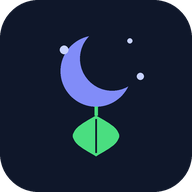

<p align="left"><a href="README.md">English</a></p>

<p align="center">
  
</p>

<h1 align="center">سالم‌زی — Salemzi</h1>

<p align="center">خواب منظم. بیداری با اراده. آب کافی.</p>

<p align="center">
  
  
  
</p>

---

سالم‌زی یه اپ اندرویدیه برای آدم‌هایی که می‌خوان خواب‌شون رو جدی بگیرن. موقع خواب گوشی رو قفل می‌کنه، میوتش می‌کنه و اینترنت رو قطع می‌کنه — بعد موقع بیداری تا یه چالش رو رد نکنی آلارم قطع نمیشه. یه سیستم یادآور آب هم هست که هیدراتاسیون روزانه رو منظم نگه می‌داره.

بدون اکانت. بدون سرور. همه چیز روی دستگاه خودته.

---

## قابلیت‌ها

### قفل خواب

یه ساعت خواب و یه ساعت بیداری تنظیم می‌کنی. موقع خواب سالم‌زی خودش فعال میشه:

- گوشی میوت میشه و اینترنت قطع میشه
- یه صفحه قفل میاد — دکمه بازگشت و کلیدهای صدا غیرفعال میشن
- یه تایمر معکوس تا ساعت بیداری نشون میده؛ تاریخ هم به شمسی برای کاربران فارسی‌زبان یا میلادی نشون داده میشه
- اگه پرمیشن **نمایش روی سایر برنامه‌ها** داده باشی، صفحه قفل روی همه اپ‌ها میاد. اگه نه، از یه نوتیفیکیشن تمام‌صفحه به‌عنوان جایگزین استفاده میشه.

بعد از گذشت نصف زمان خواب، دکمه **خروج زودهنگام** ظاهر میشه. برای استفاده ازش باید همون چالش آلارم بیداری رو رد کنی — پس خروج آسون نیست.

### حالت‌های چالش

سه حالت چالش وجود داره که هم برای خروج زودهنگام و هم برای آلارم بیداری اعمال میشن:

- **ساده** — یه دکمه تأیید. مناسب کسایی که فقط می‌خوان برنامه خواب داشته باشن بدون اصطکاک زیاد.
- **ریاضی** — باید یه مسئله حل کنی. با هر جواب اشتباه سخت‌تر میشه:
  - *آسان:* یه ضرب ساده (مثلاً `۶ × ۷`)
  - *متوسط:* ضرب با جمع یا تفریق (مثلاً `(۴ × ۸) + ۱۹`)
  - *سخت:* حاصل‌ضرب دو ضرب (مثلاً `(۳ × ۶) × (۲ × ۹)`)
- **حافظه** — یه دنباله ۵ رقمی ۴ ثانیه نشون داده میشه، بعد مخفی میشه. باید از حفظ بنویسیش. اگه یادت رفت، دکمه **امتحان مجدد** یه دنباله جدید نشون میده.

### آلارم بیداری

موقع بیداری آلارم میزنه و صفحه چالش نشون داده میشه:

- آلارم تا وقتی چالش رو رد نکنی قطع نمیشه — نه snooze، نه دکمه dismiss
- صدای آلارم می‌تونه پیش‌فرض سیستم باشه، هر رینگتونی که بخوای، یا یه فایل صوتی از حافظه گوشی
- صفحه چالش از نوتیفیکیشن و برنامه‌های اخیر هم قابل دسترسه — رفتن به اپ دیگه فراری نیست
- اگه موقع بیداری صفحه قفل از قبل باز باشه، نوتیفیکیشن تکراری نمیاد

### برنامه خواب

- **حالت زمان‌بندی شده:** خواب و بیداری هر روز خودکار در ساعت تنظیم‌شده فعال میشن. ۱۵ دقیقه قبل از خواب هم یه نوتیفیکیشن یادآور میاد.
- **حالت دستی:** با یه ضربه می‌تونی الان و بدون منتظر موندن برای ساعت برنامه‌ریزی‌شده، حالت خواب رو فعال کنی.
- بعد از راه‌اندازی مجدد دستگاه، همه آلارم‌ها به‌طور خودکار بازیابی میشن.

### یادآور آب

- ۸ یادآور در طول روز
- زمان‌ها بر اساس وعده‌های غذاییت (صبحانه، ناهار، شام) محاسبه میشن تا بهترین فاصله‌های هیدراتاسیون رو داشته باشی
- به‌صورت پنجره popup روی صفحه (اگه پرمیشن داشته باشی) یا نوتیفیکیشن نشون داده میشه
- هر روز خودکار برای فردا تنظیم میشه

---

## پیش‌نیازها

| | |
|---|---|
| اندروید | ۱۱ (API 30) یا بالاتر |
| `POST_NOTIFICATIONS` | برای نوتیفیکیشن‌های خواب، بیداری و آب |
| `SCHEDULE_EXACT_ALARM` | برای تنظیم دقیق ساعت خواب و یادآورهای آب |
| `FOREGROUND_SERVICE` | برای اجرای آلارم در پس‌زمینه |
| `BIND_VPN_SERVICE` | برای قطع اینترنت در زمان خواب |
| `SYSTEM_ALERT_WINDOW` | اختیاری — نمایش صفحه قفل روی سایر برنامه‌ها |

اپ در اولین اجرا مرحله‌به‌مرحله پرمیشن‌های لازم رو ازت می‌خواد.

---

## نصب و اجرا

```bash
git clone https://github.com/mehranlatifi83/salemzi.git
cd salemzi
```

پروژه رو در **Android Studio Hedgehog (2023.1.1) یا جدیدتر** باز کن و روی یه دستگاه واقعی یا شبیه‌ساز با اندروید ۱۱+ اجرا کن.

> هیچ API key یا سرویس خارجی یا فایل پیکربندی خاصی لازم نیست.

---

## مجوز

[MIT](LICENSE) © ۱۴۰۵ مهران لطیفی
